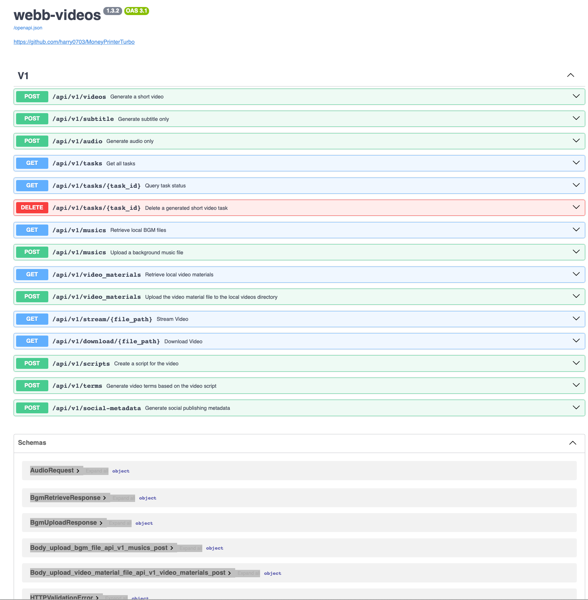

<div align="center">

# webb-videos 💸

### 一站式 AI 短视频生成工具

只需提供视频<b>主题</b>或<b>关键词</b>，即可自动生成视频脚本、匹配素材、生成字幕和背景音乐，并合成高清短视频。

[](https://gitee.com/webb-videos/webb-videos)
[](https://gitee.com/webb-videos/webb-videos)
[](https://www.python.org/)
[](./LICENSE)

</div>

---

## 📋 目录

- [界面预览](#界面预览-️)
- [功能特性](#功能特性-)
- [配置要求](#配置要求-)
- [快速开始](#快速开始-)
- [安装部署](#安装部署-)
- [语音合成](#语音合成-)
- [字幕生成](#字幕生成-)
- [背景音乐](#背景音乐-)
- [常见问题](#常见问题-)
- [许可证](#许可证-)

---

## 界面预览 🖥️

```
┌─────────────────────────────────────────────────────────────────┐
│  webb-videos 主界面                                              │
├─────────────────────────────────────────────────────────────────┤
│                                                                 │
│   ┌──────────────────────────────────────────────────────┐     │
│   │ 🎬 视频主题                                           │     │
│   │ [ 人工智能如何改变日常生活                         ] │     │
│   ├──────────────────────────────────────────────────────┤     │
│   │ 🎨 视频尺寸                                           │     │
│   │ [●] 竖屏 9:16 (1080x1920)                             │     │
│   │ [ ] 横屏 16:9 (1920x1080)                             │     │
│   ├──────────────────────────────────────────────────────┤     │
│   │ 🤖 AI 模型                                            │     │
│   │ [ Kimi / Moonshot AI  ▼ ]                             │     │
│   ├──────────────────────────────────────────────────────┤     │
│   │ 🎵 语音合成                                           │     │
│   │ [ Edge TTS (免费)    ▼ ]                             │     │
│   ├──────────────────────────────────────────────────────┤     │
│   │ 📜 字幕设置                                           │     │
│   │ [✓] 自动生成字幕  字体: [ 微软雅黑  ▼ ]               │     │
│   ├──────────────────────────────────────────────────────┤     │
│   │ 🎶 背景音乐                                           │     │
│   │ [ 随机选择   ▼ ]  音量: [■■□□□□□□□□] 30%            │     │
│   └──────────────────────────────────────────────────────┘     │
│                                                                 │
│                    [  🚀 开始生成视频  ]                         │
│                                                                 │
└─────────────────────────────────────────────────────────────────┘
```

### WebUI 界面


### API 接口界面



---

## 功能特性 🎯

### 核心功能矩阵

```
                    ┌──────────────────────────────┐
                    │      webb-videos 功能概览      │
                    └──────────────────────────────┘
                                   │
          ┌────────────────────────┼────────────────────────┐
          │                        │                        │
          ▼                        ▼                        ▼
   ┌──────────────┐        ┌──────────────┐        ┌──────────────┐
   │   🎬 视频    │        │   🗣️ 语音    │        │   🎨 素材    │
   ├──────────────┤        ├──────────────┤        ├──────────────┤
   │ AI 自动生成  │        │ Edge TTS     │        │ 本地素材     │
   │ 自定义脚本   │        │ Azure TTS    │        │ Pexels       │
   │ 批量生成     │        │ Gemini TTS   │        │ Pixabay      │
   │ 多尺寸支持   │        │ ElevenLabs   │        │ Coverr       │
   └──────────────┘        └──────────────┘        └──────────────┘
          │                        │                        │
          └────────────────────────┼────────────────────────┘
                                   │
          ┌────────────────────────┼────────────────────────┐
          │                        │                        │
          ▼                        ▼                        ▼
   ┌──────────────┐        ┌──────────────┐        ┌──────────────┐
   │   📜 字幕    │        │   🎵 音乐    │        │   📤 发布    │
   ├──────────────┤        ├──────────────┤        ├──────────────┤
   │ 自动生成     │        │ 随机选择     │        │ TikTok       │
   │ 样式可调     │        │ 自定义音乐   │        │ Instagram    │
   │ 字体颜色     │        │ 音量调节     │        │ YouTube      │
   │ 描边背景     │        │ 多格式支持   │        │ Shorts       │
   └──────────────┘        └──────────────┘        └──────────────┘
```

### 功能详解

| 模块 | 功能 | 状态 |
|------|------|------|
| **视频生成** | AI 自动生成视频脚本 | ✅ |
| | 支持自定义脚本 | ✅ |
| | 批量视频生成 | ✅ |
| | 竖屏 9:16 (1080x1920) | ✅ |
| | 横屏 16:9 (1920x1080) | ✅ |
| **语音合成** | Edge TTS (免费) | ✅ |
| | Azure TTS V2 | ✅ |
| | Google Gemini TTS | ✅ |
| | 小米 MiMo TTS | ✅ |
| | ElevenLabs TTS | ✅ |
| **字幕生成** | 自动字幕 (edge 模式) | ✅ |
| | Whisper 转写模式 | ✅ |
| | 字体/颜色/描边可调 | ✅ |
| **素材来源** | 本地素材 | ✅ |
| | Pexels 图库 | ✅ |
| | Pixabay 图库 | ✅ |
| | Coverr 视频 | ✅ |

### 四种使用方式

```
┌─────────────────────────────────────────────────────────────────┐
│                    webb-videos 使用方式                          │
├─────────────────────────────────────────────────────────────────┤
│                                                                 │
│    🤖 AI Agent          🖥️ WebUI                               │
│    ├─ 零配置             ├─ 图形化界面                          │
│    ├─ 智能对话生成       ├─ 直观易用                            │
│    ├─ 最省心             ├─ 推荐新手                            │
│    └─ 适合不想折腾       └─ 可视化操作                          │
│                                                                 │
│    🔌 API               ⌨️ CLI                                 │
│    ├─ RESTful接口        ├─ 命令行工具                          │
│    ├─ 可集成系统         ├─ 自动化批处理                        │
│    ├─ 程序化调用         ├─ 适合开发者                          │
│    └─ 适合二次开发       └─ 脚本自动化                          │
│                                                                 │
└─────────────────────────────────────────────────────────────────┘
```

### 支持的 AI 大模型

```
推荐度排行

⭐⭐⭐⭐⭐  ████████████████████████████  Kimi / Moonshot AI
⭐⭐⭐⭐⭐  ████████████████████████████  OpenAI
⭐⭐⭐⭐    ██████████████████████        Google Gemini
⭐⭐⭐⭐    ██████████████████████        DeepSeek
⭐⭐⭐⭐    ██████████████████████        阿里云通义千问
⭐⭐⭐⭐    ██████████████████████        Azure OpenAI
⭐⭐⭐      ████████████████              火山引擎方舟
⭐⭐⭐      ████████████████              xAI Grok
⭐⭐⭐      ████████████████              MiniMax
⭐⭐⭐      ████████████████              小米 MiMo
```

| 提供商 | 模型特点 | 推荐指数 |
|--------|---------|---------|
| **Kimi / Moonshot AI** | 长文本理解，中文优化 | ⭐⭐⭐⭐⭐ |
| **OpenAI** | GPT系列，综合能力强 | ⭐⭐⭐⭐⭐ |
| **Google Gemini** | 多模态，免费额度大 | ⭐⭐⭐⭐ |
| **DeepSeek** | 国产模型，性价比高 | ⭐⭐⭐⭐ |
| **阿里云通义千问** | 中文场景优化 | ⭐⭐⭐⭐ |
| **Microsoft Azure OpenAI** | 企业级服务 | ⭐⭐⭐⭐ |
| **火山引擎方舟** | 豆包系列模型 | ⭐⭐⭐ |
| **xAI Grok** | 马斯克旗下模型 | ⭐⭐⭐ |
| **MiniMax** | 自研大模型 | ⭐⭐⭐ |
| **小米 MiMo** | 小米AI模型 | ⭐⭐⭐ |

### 一键发布平台

```
📤 视频生成完成后自动发布
│
├─ 🎵 TikTok      → 短视频平台
├─ 📸 Instagram   → 图片社交平台
└─ ▶️ YouTube     → 长视频平台
       └─ Shorts  → 短视频栏目
```

---

## 配置要求 📦

### 系统要求

| 项目 | 最低配置 | 推荐配置 | 理想配置 |
|------|---------|---------|---------|
| **系统** | Windows 10 / macOS 11.0 / Linux | Windows 11 / macOS 12+ / Linux | 最新稳定版系统 |
| **CPU** | 4核 | 6-8核 | 8核及以上 |
| **内存** | 4GB | 8GB | 16GB及以上 |
| **GPU** | 非必须 | 4GB显存 | 8GB显存及以上 |
| **Python** | 3.11 | 3.11 | 3.11 |

### 性能对比

```
📊 视频生成速度对比（1分钟视频，相同配置下）

无 GPU        ████████████████████████████████████  120s
4GB 显存      ██████████████████████████            90s
8GB 显存      ████████████████████                  70s
16GB 显存     ██████████████                        55s

📊 批量生成效率（同时生成5个视频）

无 GPU        ████████████████████████████████████████████████████  10min
4GB 显存      ██████████████████████████████████                    7.5min
8GB 显存      ████████████████████████████                          6min
16GB 显存     ██████████████████████                                4.5min
```

---

## 快速开始 🚀

### 推荐使用方式

```
┌─────────────────────────────────────────────────────┐
│              选择适合你的使用方式                     │
├─────────────────────────────────────────────────────┤
│                                                     │
│   🚫 不想安装配置                                     │
│   → 🤖 AI Agent 方式（推荐）                         │
│                                                     │
│   🪟 Windows 用户                                    │
│   → 📦 手动部署（uv）                                │
│                                                     │
│   🍎 macOS / Linux 用户                              │
│   → 📦 手动部署（uv）                                │
│                                                     │
│   🐳 需要隔离环境                                    │
│   → 🐳 Docker 部署                                   │
│                                                     │
└─────────────────────────────────────────────────────┘
```

### 方式一：使用 AI Agent 生成视频

如果你的 AI Agent 支持读取 Skill 文档并操作本地终端，可以直接发送下面这段话：

```text
使用这个 Skill：https://gitee.com/webb-videos/webb-videos/raw/main/docs/skill/SKILL.md
帮我生成一个主题为"人工智能如何改变普通人的日常生活"的视频。
```

---

## 安装部署 📥

### 前提条件

- ✅ Python 3.11 或更高版本
- ✅ Windows用户避免中文/特殊字符/空格路径

### Docker 部署 🐳

```
┌──────────────────────────────────────────────────────┐
│                 Docker 部署流程                       │
├──────────────────────────────────────────────────────┤
│                                                      │
│  步骤一：克隆项目                                     │
│  ┌────────────────────────────────────────────┐     │
│  │ git clone https://gitee.com/webb-videos/    │     │
│  │            webb-videos.git                  │     │
│  │ cd webb-videos                              │     │
│  └────────────────────────────────────────────┘     │
│                                                      │
│  步骤二：启动容器                                     │
│  ┌────────────────────────────────────────────┐     │
│  │ docker compose -f                           │     │
│  │   docker-compose.release.yml up             │     │
│  └────────────────────────────────────────────┘     │
│                                                      │
│  步骤三：访问界面                                     │
│  ┌────────────────────────────────────────────┐     │
│  │ WebUI:  http://127.0.0.1:8501               │     │
│  │ API:    http://127.0.0.1:8080/docs          │     │
│  └────────────────────────────────────────────┘     │
│                                                      │
└──────────────────────────────────────────────────────┘
```

#### 步骤一：克隆项目

```shell
git clone https://gitee.com/webb-videos/webb-videos.git
cd webb-videos
```

#### 步骤二：启动 Docker

```shell
docker compose -f docker-compose.release.yml up
```

#### 步骤三：访问界面

| 服务 | 地址 | 说明 |
|------|------|------|
| **WebUI** | http://127.0.0.1:8501 | 图形化界面 |
| **API文档** | http://127.0.0.1:8080/docs | Swagger文档 |
| **Redoc** | http://127.0.0.1:8080/redoc | 替代文档 |

### 手动部署 📦

```
┌──────────────────────────────────────────────────────┐
│                 手动部署流程（uv）                     │
├──────────────────────────────────────────────────────┤
│                                                      │
│  步骤一：克隆代码                                     │
│  ┌────────────────────────────────────────────┐     │
│  │ git clone https://gitee.com/webb-videos/    │     │
│  │            webb-videos.git                  │     │
│  │ cd webb-videos                              │     │
│  └────────────────────────────────────────────┘     │
│                                                      │
│  步骤二：创建虚拟环境                                 │
│  ┌────────────────────────────────────────────┐     │
│  │ uv python install 3.11                      │     │
│  │ uv sync --frozen                            │     │
│  └────────────────────────────────────────────┘     │
│                                                      │
│  步骤三：启动 WebUI                                   │
│  ┌────────────────────────────────────────────┐     │
│  │ Windows: .\webui.bat                        │     │
│  │ macOS/Linux: sh webui.sh                    │     │
│  └────────────────────────────────────────────┘     │
│                                                      │
│  步骤四：启动 API（可选）                             │
│  ┌────────────────────────────────────────────┐     │
│  │ uv run python main.py                       │     │
│  └────────────────────────────────────────────┘     │
│                                                      │
│  步骤五：命令行方式（无浏览器）                       │
│  ┌────────────────────────────────────────────┐     │
│  │ uv run python cli.py --video-subject        │     │
│  │   "人工智能如何改变日常生活"                │     │
│  └────────────────────────────────────────────┘     │
│                                                      │
└──────────────────────────────────────────────────────┘
```

#### 步骤一：克隆代码

```shell
git clone https://gitee.com/webb-videos/webb-videos.git
cd webb-videos
```

#### 步骤二：创建虚拟环境（推荐使用 uv）

```shell
uv python install 3.11
uv sync --frozen
```

如果你暂时不使用 `uv`，也可以继续使用 `venv + pip`：

```shell
python3.11 -m venv .venv
source .venv/bin/activate
pip install -r requirements.txt
```

#### 步骤三：启动 WebUI

**Windows:**
```powershell
.\webui.bat
```

**macOS / Linux:**
```shell
sh webui.sh
```

如需允许局域网内其他设备访问：
```shell
MPT_WEBUI_HOST=0.0.0.0 sh webui.sh
```

#### 步骤四：启动 API 服务（可选）

```shell
uv run python main.py
```

#### 步骤五：纯命令行方式（无浏览器）

```shell
# 生成视频
uv run python cli.py --video-subject "人工智能如何改变日常生活"

# 查看帮助
uv run python cli.py --help
```

---

## 语音合成 🗣

### 支持的语音服务对比

```
语音服务选择指南

免费程度          质量                中文支持
  ████           ██████              ██████
 Edge TTS    ElevenLabs         Azure TTS
 (免费)       (付费)             (付费)

  ████           ██████              ██████
 Gemini      Azure TTS          Google
 (免费额度)    (付费)             Gemini

  ██             ████                ██████
 小米          SiliconFlow        小米 MiMo
 MiMo          (付费)             (付费)
```

| 服务 | 特点 | 是否需要API Key | 推荐指数 |
|------|------|---------------|---------|
| **Edge TTS** | 免费，微软云端服务 | ❌ 不需要 | ⭐⭐⭐⭐⭐ |
| **Azure TTS V2** | 高质量，多语言 | ✅ 需要 | ⭐⭐⭐⭐⭐ |
| **SiliconFlow TTS** | 国产服务 | ✅ 需要 | ⭐⭐⭐⭐ |
| **Google Gemini TTS** | 免费额度大 | ✅ 需要 | ⭐⭐⭐⭐ |
| **小米 MiMo TTS** | 小米AI服务 | ✅ 需要 | ⭐⭐⭐ |
| **ElevenLabs TTS** | 高质量英文 | ✅ 需要 | ⭐⭐⭐⭐ |

> 💡 **提示**: 默认使用免费的 Edge TTS，在 WebUI 中显示为 Azure TTS V1

---

## 字幕生成 📜

### 两种字幕模式对比

```
┌─────────────────────────────────────────────────────────────────┐
│                      字幕模式对比                                │
├─────────────────────────────┬───────────────────────────────────┤
│      模式一：edge           │        模式二：whisper            │
│      (推荐，默认)            │        (高精度，可选)             │
├─────────────────────────────┼───────────────────────────────────┤
│                             │                                   │
│  ✓ 使用 TTS 时间戳生成      │  ✓ 使用 faster-whisper 转写     │
│  ✓ 速度快                   │  ✓ 更准确的时间轴                │
│  ✓ 不需要 GPU               │  ✓ 需要模型下载                  │
│  ✓ 适合大多数场景           │  ✓ 需要 GPU 加速（可选）         │
│                             │                                   │
│  推荐：日常使用             │  推荐：需要精确字幕              │
│                             │                                   │
└─────────────────────────────┴───────────────────────────────────┘
```

### 配置方式

在 `config.toml` 中修改：

```toml
[app]
subtitle_provider = "whisper"

[whisper]
model_size = "large-v3-turbo"  # 约1.6GB，更快更小
# model_size = "large-v3"      # 约3GB，更准确
```

> 首次使用 Whisper 时，程序会自动从 Hugging Face 下载模型。如果网络无法自动下载，可以从 [Hugging Face](https://huggingface.co/Systran/faster-whisper-large-v3) 手动下载。

---

## 背景音乐 🎵

音乐文件位于项目的 `resource/songs` 目录下，你可以：

```
音乐使用流程

┌──────────────┐     ┌──────────────┐     ┌──────────────┐
│ 选择音乐来源  │────▶│ 设置音量参数  │────▶│ 生成视频     │
└──────────────┘     └──────────────┘     └──────────────┘
      │                    │
      ▼                    ▼
  ┌────────┐          ┌────────┐
  │随机选择 │          │0% - 100%│
  │自定义   │          │        │
  │静音     │          │        │
  └────────┘          └────────┘
```

- ✅ 使用默认音乐
- ✅ 添加自己的音乐文件
- ✅ 在 WebUI 中选择音乐
- ✅ 调节音乐音量

> ⚠️ **注意**: 默认音乐来自YouTube视频，仅供学习使用，商业用途请替换为自己的音乐

---

## 常见问题 🤔

<details>
<summary><b>❓ 如何发布到 TikTok、Instagram 或 YouTube Shorts？</b></summary>

注册 [Upload-Post](https://upload-post.com/) 账号并获取 API Key，然后在 `config.toml` 中添加配置：

```toml
[app]
upload_post_enabled = true
upload_post_api_key = "your-api-key"
upload_post_username = "your-username"
upload_post_platforms = ["tiktok", "instagram", "youtube"]
upload_post_auto_upload = true
upload_post_youtube_privacy_status = "public"
```

保存配置并重启项目。视频生成完成后，程序会自动发布到已配置的平台。YouTube 可见性可设置为 `public`、`unlisted` 或 `private`。

</details>

<details>
<summary><b>❓ RuntimeError: No ffmpeg exe could be found</b></summary>

通常情况下，ffmpeg 会被自动下载，并且会被自动检测到。
但是如果你的环境有问题，无法自动下载，可能会遇到如下错误：

```
RuntimeError: No ffmpeg exe could be found.
Install ffmpeg on your system, or set the IMAGEIO_FFMPEG_EXE environment variable.
```

此时你可以从 https://www.gyan.dev/ffmpeg/builds/ 下载ffmpeg，解压后，在 `config.toml` 中设置 `ffmpeg_path` 为你的实际安装路径即可。

```toml
[app]
ffmpeg_path = "C:\\Users\\webb\\Downloads\\ffmpeg.exe"
```

</details>

<details>
<summary><b>❓ OSError: [Errno 24] Too many open files</b></summary>

这个问题是由于系统打开文件数限制导致的，可以通过修改系统的文件打开数限制来解决。

查看当前限制：

```shell
ulimit -n
```

如果过低，可以调高一些：

```shell
ulimit -n 10240
```

</details>

<details>
<summary><b>❓ Whisper 模型下载失败怎么办？</b></summary>

从 [Hugging Face](https://huggingface.co/Systran/faster-whisper-large-v3) 手动下载模型，解压后放到：

```
webb-videos
  ├─models
  │   └─whisper-large-v3
  │          config.json
  │          model.bin
  │          preprocessor_config.json
  │          tokenizer.json
  │          vocabulary.json
```

</details>

---

## 项目架构 🏗️

```
                    webb-videos 项目架构
                          │
          ┌───────────────┼───────────────┐
          │               │               │
          ▼               ▼               ▼
   ┌──────────────┐ ┌──────────────┐ ┌──────────────┐
   │  app/        │ │  webui/      │ │  resource/   │
   │  核心代码    │ │  Web界面     │ │  资源文件    │
   ├──────────────┤ ├──────────────┤ ├──────────────┤
   │ config/      │ │ Main.py      │ │ fonts/       │
   │ controllers/ │ │ styles.css   │ │ songs/       │
   │ models/      │ │ i18n/        │ │ public/      │
   │ services/    │ │              │ │              │
   │ utils/       │ │              │ │              │
   └──────────────┘ └──────────────┘ └──────────────┘
          │               │               │
          └───────────────┼───────────────┘
                          │
                    ┌──────────────┐
                    │  docs/       │
                    │  文档        │
                    └──────────────┘
                          │
          ┌───────────────┼───────────────┐
          │               │               │
          ▼               ▼               ▼
   ┌──────────────┐ ┌──────────────┐ ┌──────────────┐
   │  main.py     │ │  cli.py      │ │  webui.bat/  │
   │  API入口     │ │  命令行      │ │  webui.sh    │
   └──────────────┘ └──────────────┘ └──────────────┘
```

### 目录说明

| 目录/文件 | 说明 |
|-----------|------|
| `app/` | 应用核心代码 |
| `app/config/` | 配置管理 |
| `app/controllers/` | 控制器层 |
| `app/models/` | 数据模型 |
| `app/services/` | 业务服务 |
| `app/utils/` | 工具函数 |
| `webui/` | Web界面 |
| `docs/` | 文档 |
| `resource/` | 资源文件 |
| `resource/fonts/` | 字体文件 |
| `resource/songs/` | 背景音乐 |
| `main.py` | API服务入口 |
| `cli.py` | 命令行工具 |
| `webui.bat/sh` | WebUI启动脚本 |

---

## 技术栈 🔧

| 技术 | 用途 | 版本 |
|------|------|------|
| **Python** | 核心编程语言 | 3.11+ |
| **Streamlit** | WebUI 框架 | latest |
| **FastAPI** | API 框架 | latest |
| **Docker** | 容器化部署 | latest |
| **uv** | Python 包管理 | latest |


---

## 许可证 📝

本项目采用 MIT 许可证，详见 [LICENSE](LICENSE) 文件

---

<div align="center">

### 🌟 如果这个项目对你有帮助，请给一个 Star ⭐

**Made with ❤️ by webb**

</div>
